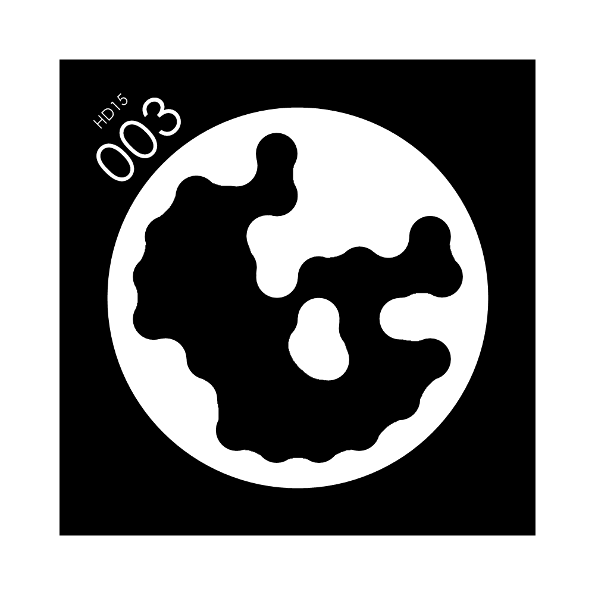
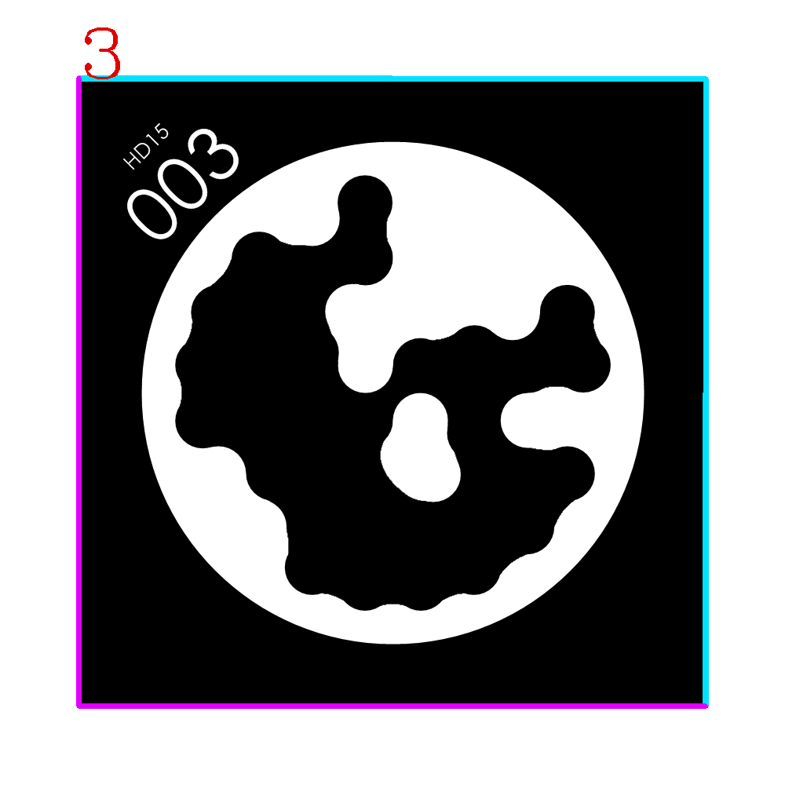

# This is a simple python binding of [Stag Fiducial Marker System](https://github.com/bbenligiray/stag)


# Install

1.clone this repository
   ```shell
   git clone --recursive https://github.com/Sologala/pyStag.git
   ```
2.Build with python setup.py 

```shell
python setup.py develop

```
The above command line will build `pyStag` at local folder. Alternatively, you can install it by
```shell
python setup.py install --record manifest.txt
```
It will record all installed file in `manifest.txt`

# Uninstall 
```shell
xargs  rm < manifest.txt
```
Or, you can use `pip`

```shell
pip uninstall pyStag
```   

#  Test and Usage 

```python
python test_warpper.py
```

The script will detect `00003.png` and place its detection result at `img-res.png`

  




# PS.

Now, this is  just a prototype for warpping Stag system. It has only few attributes and interfaces, and function, And I will add some more in the future.

thank to [edmBernard](https://github.com/edmBernard)'s work https://github.com/edmBernard/pybind11_opencv_numpy, let the conversion between numpy and cv::Mat works fine.


# STag: A Stable Fiducial Marker System

Code used in the following paper:

[B. Benligiray; C. Topal; C. Akinlar, "STag: A Stable Fiducial Marker System," Image and Vision Computing (Accepted), 2019.](https://arxiv.org/abs/1707.06292)

Markers (see `ref/marker generator` for reference code for marker generation):

https://drive.google.com/drive/folders/0ByNTNYCAhWbIV1RqdU9vRnd2Vnc

### ROS Package

- [STag ROS: A ROS package for the Stable Fiducial Marker System](https://github.com/usrl-uofsc/stag_ros/) by Unmanned Systems & Robotics Lab - UofSC

- [ROS wrapper for STag](https://github.com/dartmouthrobotics/stag_ros) by Dartmouth Reality and Robotics Lab

[](https://www.youtube.com/watch?v=vnHI3GzLVrY) 

Some figures from the paper:

<p align="center">
  
</p>

<p align="center">
  
</p>
